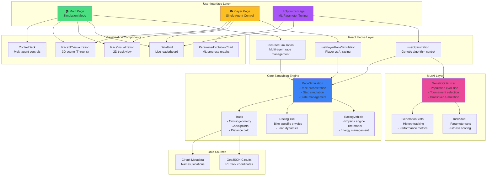
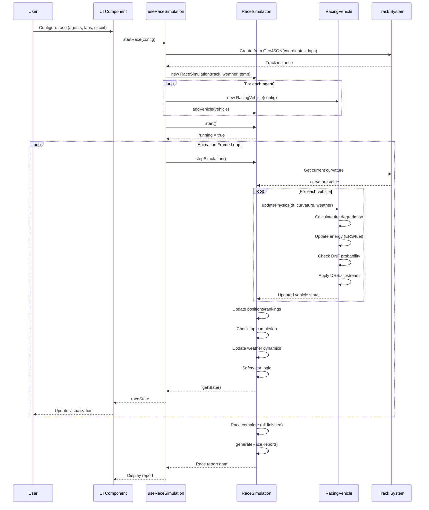
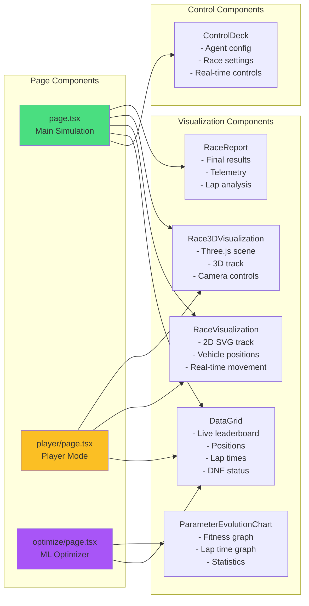
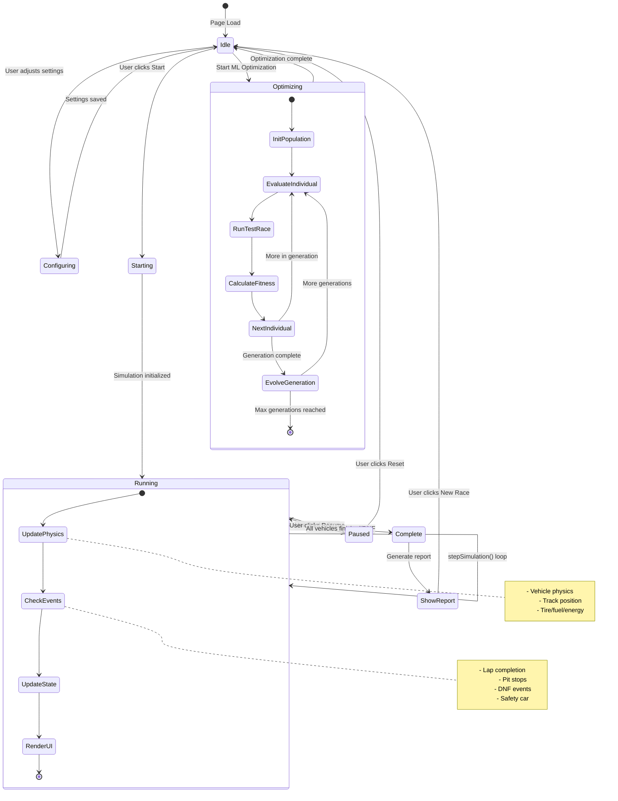
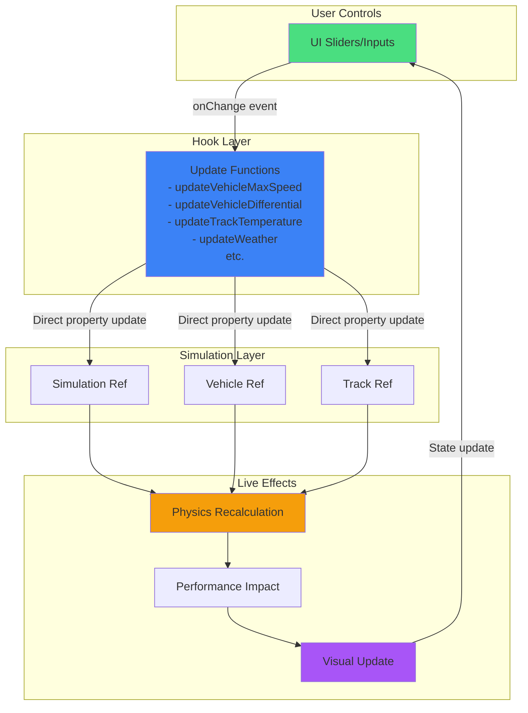
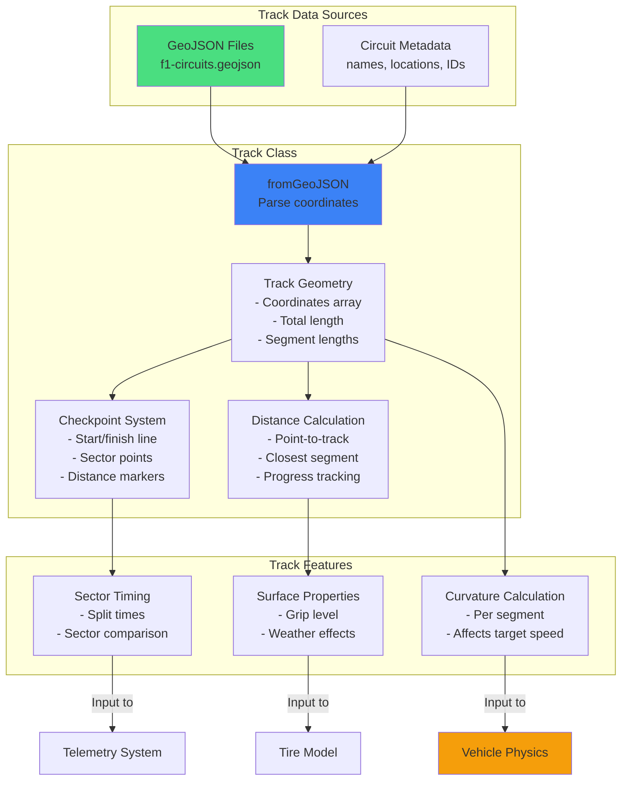
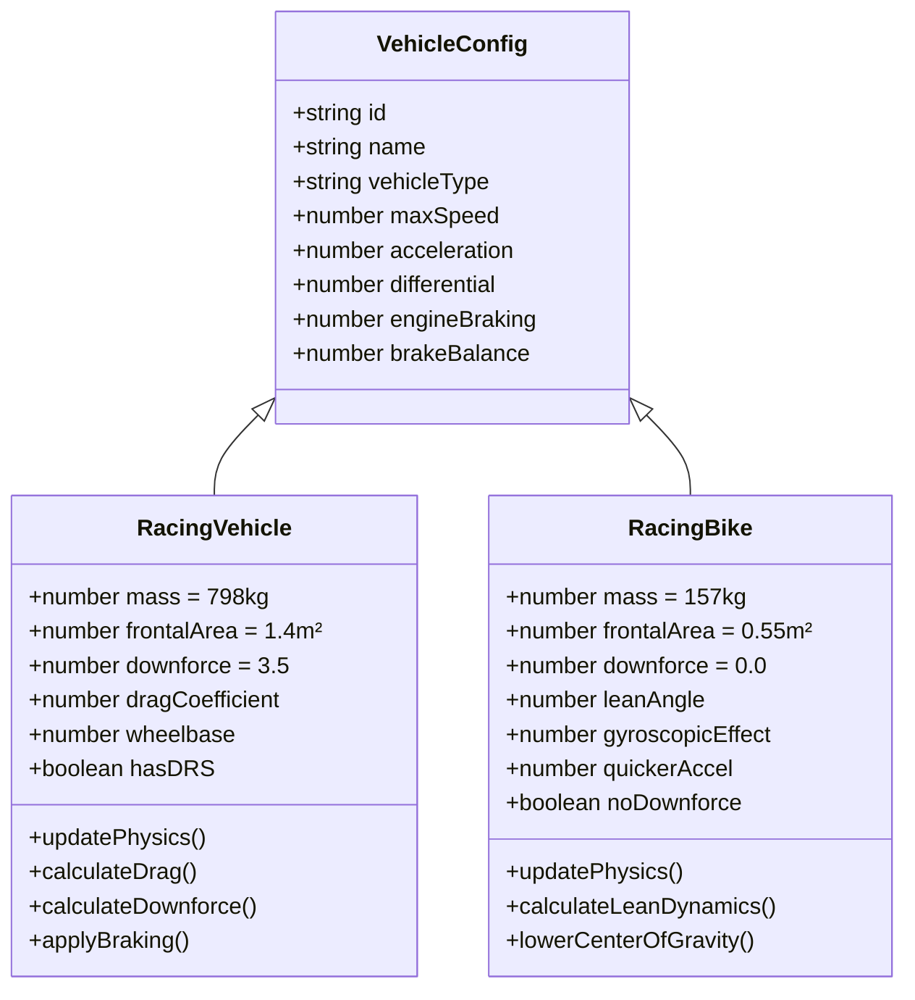
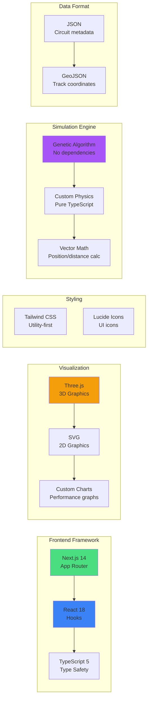

# Racing Simulator - System Architecture

## System Overview



## Detailed Data Flow - Race Simulation



## ML Optimization Flow

```mermaid
flowchart TD
    Start([User Starts Optimization]) --> Init[Initialize GeneticOptimizer<br/>- Population size<br/>- Mutation rate<br/>- Max generations]
    
    Init --> GenPop[Generate Random Population<br/>Each individual = parameter set]
    
    GenPop --> EvalGen{Evaluate Generation}
    
    EvalGen --> EvalInd[For each individual]
    
    EvalInd --> RunRace[Run Race with Parameters<br/>- differential<br/>- engine braking<br/>- brake balance<br/>- max speed<br/>- acceleration]
    
    RunRace --> Measure[Measure Performance<br/>- Avg lap time<br/>- Best lap time<br/>- Position<br/>- DNF status]
    
    Measure --> CalcFit[Calculate Fitness<br/>fitness = 10000/lapTime<br/>+ positionBonus<br/>+ consistencyBonus]
    
    CalcFit --> NextInd{More individuals?}
    
    NextInd -->|Yes| EvalInd
    NextInd -->|No| RecordStats[Record Generation Stats<br/>- Best fitness<br/>- Avg fitness<br/>- Best lap time]
    
    RecordStats --> CheckComplete{Generation >= Max<br/>OR<br/>Target fitness reached?}
    
    CheckComplete -->|Yes| Complete([Optimization Complete<br/>Return best parameters])
    
    CheckComplete -->|No| Sort[Sort by Fitness<br/>Best to Worst]
    
    Sort --> Elite[Keep Elite<br/>Top 10% preserved]
    
    Elite --> Select[Tournament Selection<br/>Pick parents for breeding]
    
    Select --> Crossover[Crossover/Breeding<br/>child = parent1 * α + parent2 * (1-α)]
    
    Crossover --> Mutate[Mutation<br/>15% chance per parameter<br/>Small random adjustments]
    
    Mutate --> NewPop[New Population Created]
    
    NewPop --> NextGen[Increment Generation]
    
    NextGen --> EvalGen
    
    style Start fill:#4ade80
    style Complete fill:#22c55e
    style RunRace fill:#3b82f6
    style CalcFit fill:#f59e0b
    style Elite fill:#a855f7
    style Mutate fill:#ec4899
```

## Component Architecture



## Physics Engine Data Flow

```mermaid
graph TD
    Start[Vehicle Physics Update] --> GetCurv[Get Track Curvature<br/>from current position]
    
    GetCurv --> CalcTarget[Calculate Target Speed<br/>- Base corner speed<br/>- Weather modifier<br/>- Tire grip]
    
    CalcTarget --> Accel{Current Speed<br/>< Target Speed?}
    
    Accel -->|Yes| ApplyAccel[Apply Acceleration<br/>- Engine power<br/>- Differential effect<br/>- Tire grip limit]
    Accel -->|No| ApplyBrake[Apply Braking<br/>- Brake balance<br/>- Engine braking<br/>- ABS simulation]
    
    ApplyAccel --> UpdateSpeed[Update Speed]
    ApplyBrake --> UpdateSpeed
    
    UpdateSpeed --> DRS{DRS Available<br/>& Activated?}
    
    DRS -->|Yes| AddDRS[+10% speed boost]
    DRS -->|No| Slipstream{In Slipstream?}
    
    AddDRS --> UpdatePos
    Slipstream -->|Yes| AddSlip[+5% speed boost]
    Slipstream -->|No| UpdatePos[Update Position<br/>position += speed * dt]
    
    AddSlip --> UpdatePos
    
    UpdatePos --> TireDeg[Update Tire Degradation<br/>- Wear from distance<br/>- Temp from speed<br/>- Compound effects]
    
    TireDeg --> Energy[Update Energy<br/>- Fuel consumption<br/>- ERS harvest/deploy<br/>- Battery level]
    
    Energy --> Damage[Update Damage<br/>- Random mechanical<br/>- Crash probability<br/>- Component wear]
    
    Damage --> CheckDNF{DNF Check<br/>Per-lap probability}
    
    CheckDNF -->|DNF| SetDNF[Mark as DNF<br/>finished = true<br/>Stop updates]
    CheckDNF -->|Continue| CheckLap{Crossed<br/>Start/Finish?}
    
    CheckLap -->|Yes| RecordLap[Record Lap<br/>- Lap time<br/>- Telemetry<br/>- Check pit stop]
    CheckLap -->|No| CheckPit{Pit Stop<br/>Requested?}
    
    RecordLap --> CheckPit
    
    CheckPit -->|Yes| ExecutePit[Execute Pit Stop<br/>- Change tires<br/>- Add fuel<br/>- Fix damage<br/>- 20-25s duration]
    CheckPit -->|No| End[End Physics Update]
    
    ExecutePit --> End
    SetDNF --> End
    
    style Start fill:#4ade80
    style UpdateSpeed fill:#3b82f6
    style CheckDNF fill:#ef4444
    style ExecutePit fill:#f59e0b
    style End fill:#22c55e
```



## State Management Flow



## Real-time Control System



## Track System Architecture



## Vehicle Type System



## File Structure

```
frontend/
├── app/
│   ├── page.tsx                    # Main simulation mode
│   ├── player/
│   │   └── page.tsx               # Player vs AI mode
│   ├── optimize/
│   │   └── page.tsx               # ML optimizer mode
│   ├── layout.tsx                 # Root layout
│   └── globals.css                # Global styles
│
├── components/
│   ├── ControlDeck.tsx            # Multi-agent control panel
│   ├── DataGrid.tsx               # Live leaderboard
│   ├── RaceVisualization.tsx      # 2D SVG visualization
│   ├── Race3DVisualization.tsx    # 3D Three.js scene
│   ├── ParameterEvolutionChart.tsx # ML progress charts
│   ├── RaceReport.tsx             # Post-race analysis
│   └── ConnectionStatus.tsx       # WebSocket status
│
├── lib/
│   ├── hooks/
│   │   ├── useRaceSimulation.ts   # Main simulation hook
│   │   ├── usePlayerRaceSimulation.ts # Player mode hook
│   │   └── useOptimization.ts     # ML optimization hook
│   │
│   ├── simulation/
│   │   └── RaceSimulation.ts      # Core race engine
│   │
│   ├── physics/
│   │   ├── RacingVehicle.ts       # Car physics & telemetry
│   │   └── RacingBike.ts          # Bike physics variant
│   │
│   ├── track/
│   │   └── Track.ts               # Track geometry & features
│   │
│   └── ml/
│       ├── GeneticOptimizer.ts    # Genetic algorithm
│       └── types.ts               # ML type definitions
│
└── public/
    └── data/
        └── circuits/
            ├── f1-circuits.json    # Circuit metadata
            └── f1-circuits.geojson # Track coordinates
```

## Technology Stack



## Key Design Patterns

### 1. **Hook-based State Management**
- Each mode has its own hook (`useRaceSimulation`, `usePlayerRaceSimulation`, `useOptimization`)
- Hooks encapsulate simulation logic and state
- Components remain presentational

### 2. **Ref-based Simulation Control**
- Simulation runs in refs to avoid re-renders
- `requestAnimationFrame` loop for smooth updates
- State updates at controlled intervals (10 FPS)

### 3. **Component Composition**
- Shared components (DataGrid, visualizations)
- Mode-specific controls (ControlDeck, ML charts)
- Modular architecture for easy extension

### 4. **Real-time Updates**
- Direct property mutations for live controls
- No state reconciliation needed
- Immediate physics response

### 5. **Genetic Algorithm**
- Pure TypeScript implementation
- Population-based evolution
- Tournament selection + crossover + mutation
- Fitness-based optimization
