# Racing Simulator - System Architecture

## System Overview


## Detailed Data Flow - Race Simulation


## ML Optimization Flow

```mermaid
flowchart TD
    Start([User Starts Optimization]) --> Init[Initialize GeneticOptimizer<br/>- Population size<br/>- Mutation rate<br/>- Max generations]
    
    Init --> GenPop[Generate Random Population<br/>Each individual = parameter set]
    
    GenPop --> EvalGen{Evaluate Generation}
    
    EvalGen --> EvalInd[For each individual]
    
    EvalInd --> RunRace[Run Race with Parameters<br/>- differential<br/>- engine braking<br/>- brake balance<br/>- max speed<br/>- acceleration]
    
    RunRace --> Measure[Measure Performance<br/>- Avg lap time<br/>- Best lap time<br/>- Position<br/>- DNF status]
    
    Measure --> CalcFit[Calculate Fitness<br/>fitness = 10000/lapTime<br/>+ positionBonus<br/>+ consistencyBonus]
    
    CalcFit --> NextInd{More individuals?}
    
    NextInd -->|Yes| EvalInd
    NextInd -->|No| RecordStats[Record Generation Stats<br/>- Best fitness<br/>- Avg fitness<br/>- Best lap time]
    
    RecordStats --> CheckComplete{Generation >= Max<br/>OR<br/>Target fitness reached?}
    
    CheckComplete -->|Yes| Complete([Optimization Complete<br/>Return best parameters])
    
    CheckComplete -->|No| Sort[Sort by Fitness<br/>Best to Worst]
    
    Sort --> Elite[Keep Elite<br/>Top 10% preserved]
    
    Elite --> Select[Tournament Selection<br/>Pick parents for breeding]
    
    Select --> Crossover[Crossover/Breeding<br/>child = parent1 * α + parent2 * (1-α)]
    
    Crossover --> Mutate[Mutation<br/>15% chance per parameter<br/>Small random adjustments]
    
    Mutate --> NewPop[New Population Created]
    
    NewPop --> NextGen[Increment Generation]
    
    NextGen --> EvalGen
    
    style Start fill:#4ade80
    style Complete fill:#22c55e
    style RunRace fill:#3b82f6
    style CalcFit fill:#f59e0b
    style Elite fill:#a855f7
    style Mutate fill:#ec4899
```

## Component Architecture


## Physics Engine Data Flow


## State Management Flow


## Real-time Control System


## Track System Architecture


## Vehicle Type System

```mermaid
classDiagram
    class VehicleConfig {
        +string id
        +string name
        +string vehicleType
        +number maxSpeed
        +number acceleration
        +number differential
        +number engineBraking
        +number brakeBalance
    }
    
    class RacingVehicle {
        +number mass = 798kg
        +number frontalArea = 1.4m²
        +number downforce = 3.5
        +updatePhysics()
        +calculateDrag()
        +calculateDownforce()
        +applyBraking()
    }
    
    class RacingBike {
        +number mass = 157kg
        +number frontalArea = 0.55m²
        +number downforce = 0.0
        +number leanAngle
        +updatePhysics()
        +calculateLeanDynamics()
        +lowerCenterOfGravity()
    }
    
    VehicleConfig <|-- RacingVehicle
    VehicleConfig <|-- RacingBike
    
    RacingVehicle : +number dragCoefficient
    RacingVehicle : +number wheelbase
    RacingVehicle : +boolean hasDRS
    
    RacingBike : +number gyroscopicEffect
    RacingBike : +number quickerAccel
    RacingBike : +boolean noDownforce
```



## File Structure

```
frontend/
├── app/
│   ├── page.tsx                    # Main simulation mode
│   ├── player/
│   │   └── page.tsx               # Player vs AI mode
│   ├── optimize/
│   │   └── page.tsx               # ML optimizer mode
│   ├── layout.tsx                 # Root layout
│   └── globals.css                # Global styles
│
├── components/
│   ├── ControlDeck.tsx            # Multi-agent control panel
│   ├── DataGrid.tsx               # Live leaderboard
│   ├── RaceVisualization.tsx      # 2D SVG visualization
│   ├── Race3DVisualization.tsx    # 3D Three.js scene
│   ├── ParameterEvolutionChart.tsx # ML progress charts
│   ├── RaceReport.tsx             # Post-race analysis
│   └── ConnectionStatus.tsx       # WebSocket status
│
├── lib/
│   ├── hooks/
│   │   ├── useRaceSimulation.ts   # Main simulation hook
│   │   ├── usePlayerRaceSimulation.ts # Player mode hook
│   │   └── useOptimization.ts     # ML optimization hook
│   │
│   ├── simulation/
│   │   └── RaceSimulation.ts      # Core race engine
│   │
│   ├── physics/
│   │   ├── RacingVehicle.ts       # Car physics & telemetry
│   │   └── RacingBike.ts          # Bike physics variant
│   │
│   ├── track/
│   │   └── Track.ts               # Track geometry & features
│   │
│   └── ml/
│       ├── GeneticOptimizer.ts    # Genetic algorithm
│       └── types.ts               # ML type definitions
│
└── public/
    └── data/
        └── circuits/
            ├── f1-circuits.json    # Circuit metadata
            └── f1-circuits.geojson # Track coordinates
```

## Technology Stack


## Key Design Patterns

### 1. **Hook-based State Management**
- Each mode has its own hook (`useRaceSimulation`, `usePlayerRaceSimulation`, `useOptimization`)
- Hooks encapsulate simulation logic and state
- Components remain presentational

### 2. **Ref-based Simulation Control**
- Simulation runs in refs to avoid re-renders
- `requestAnimationFrame` loop for smooth updates
- State updates at controlled intervals (10 FPS)

### 3. **Component Composition**
- Shared components (DataGrid, visualizations)
- Mode-specific controls (ControlDeck, ML charts)
- Modular architecture for easy extension

### 4. **Real-time Updates**
- Direct property mutations for live controls
- No state reconciliation needed
- Immediate physics response

### 5. **Genetic Algorithm**
- Pure TypeScript implementation
- Population-based evolution
- Tournament selection + crossover + mutation
- Fitness-based optimization
